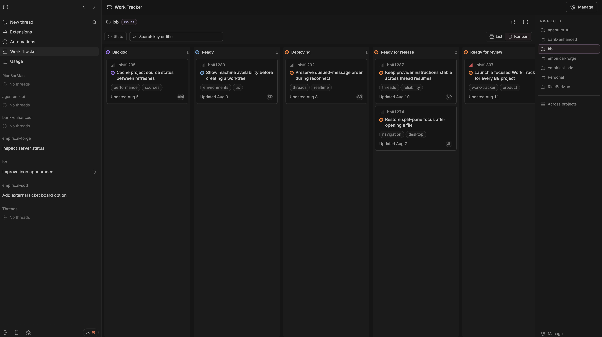

# Mateo's bb-plugins

Plugins for [BB](https://github.com/get-bb/bb), the agent IDE — kept together
in one GitHub repository.



## Dev productivity

| | Plugin | What it does |
| --- | --- | --- |
|  | [Taskboard](./plugins/taskboard) | Brings each BB project's GitHub, Linear, or Jira tasks into one focused List or Kanban board. |

## Install from source

Each plugin is an independent BB package under `plugins/<id>`. Clone the
workspace once, install its shared dependencies, and install whichever plugins
you want as local-path sources:

```sh
git clone https://github.com/MateoCerquetella/bb-plugins.git
cd bb-plugins
npm install
npm run build
bb plugin install ./plugins/taskboard
```

BB reads local-path plugins in place, so updates stay simple:

```sh
git pull
npm install
npm run build
bb plugin reload taskboard
```

Direct `bb plugin install git:...` installation targets a repository-root
manifest and therefore does not apply to this multi-plugin layout.

## Develop

Run every plugin's checks from the workspace root:

```sh
npm install
npm run check
```

New plugins belong in `plugins/<id>` with their own `package.json`, source,
tests, checked-in BB SDK declarations, and README. The root npm workspace will
pick them up automatically.

## License

[MIT](./LICENSE) © 2026 Mateo Cerquetella.
