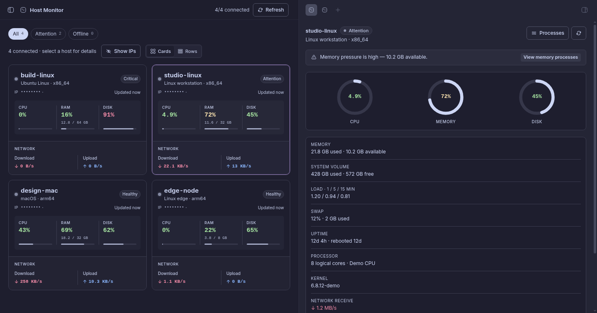
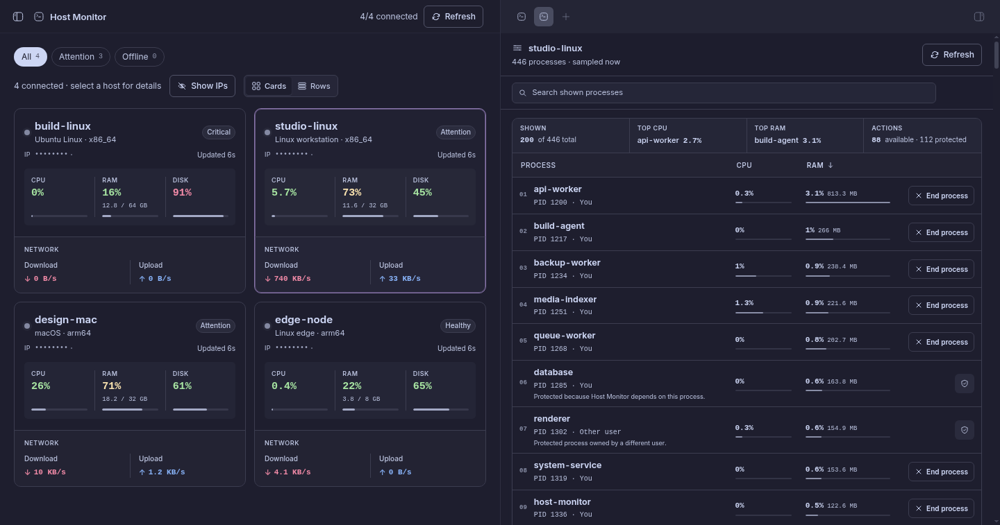
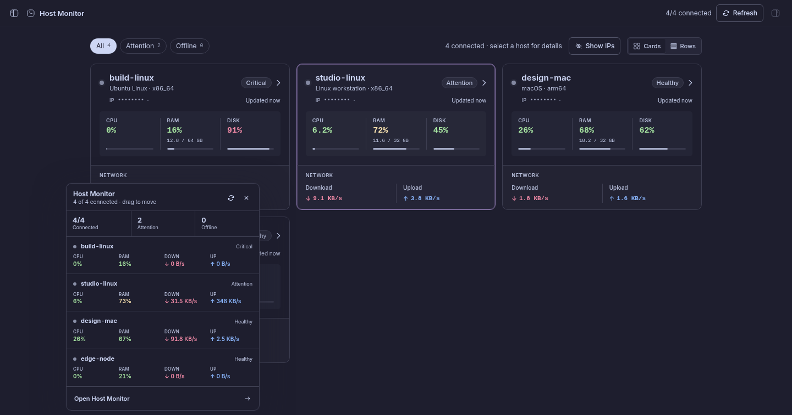

<p align="center">
  <picture>
    <source media="(prefers-color-scheme: dark)" srcset="./assets/logo-dark.svg">
    
  </picture>
</p>

<h1 align="center">Host Monitor</h1>

<p align="center">
  Live resource health and guarded process controls for every machine enrolled in bb.
</p>

<p align="center">
  <strong>bb 0.40+</strong> · <strong>macOS, Linux, and Windows</strong> · <strong>MIT</strong>
</p>



Host Monitor turns bb's enrolled machines into one live fleet view. Track CPU,
RAM, disk, network throughput, load, uptime, connection state, and sample
freshness without leaving the app. Open a machine for deeper telemetry or
inspect its current processes when resource pressure needs attention.

## Highlights

- Responsive card and row views with independent loading, offline, stale, and
  error states for every machine.
- CPU, RAM used/total, disk, download, upload, load average, swap, uptime, OS,
  kernel, and processor details.
- A compact sidebar summary plus a movable floating monitor for keeping fleet
  pressure visible anywhere in bb.
- Adjustable green/yellow/red percentage thresholds, enabled by default and
  shared across the page, sidebar, and floating window.
- A searchable, sortable process ledger with protected-process explanations
  and deliberately guarded stop actions.
- A bounded read-only `bb host-monitor snapshot` command for native companion
  surfaces such as the BB Touch Bar monitor.

## Processes when pressure matters



Open **Processes** from Host details or directly from a CPU or memory pressure
alert. The ledger refreshes only while its explicitly targeted tab is open and
supports safe name/PID search plus Process, CPU, and RAM sorting.

Host Monitor returns a bounded projection: process basename, PID, CPU,
resident memory, percentage of host RAM, and a coarse ownership category. It
does not return command lines, executable paths, working directories,
environment variables, or usernames.

## Quick view anywhere



Click the circular sidebar control for a compact summary. Drag it into the
workspace—or choose **Float monitor** for the keyboard-accessible equivalent—to
open one movable window with CPU, RAM, download, and upload readings.

## Install

### BB Community marketplace

This shorthand becomes available after
[marketplace PR #128](https://github.com/get-bb/marketplace/pull/128) is merged
and live:

```sh
bb plugin install host-monitor
```

### Direct Git release

```sh
bb plugin install git:https://github.com/MateoCerquetella/bb-plugins.git@^0.1.0 \
  --subdirectory plugins/host-monitor \
  --tag-prefix host-monitor/
```

The Git source tracks compatible `host-monitor/vX.Y.Z` releases. BB still
stages, validates, and rolls back plugin updates through its normal install
pipeline.

An installation made under Host Monitor's retired plugin id cannot update
across the rename. Remove that earlier Host Monitor entry, then install
`host-monitor`; threshold settings are scoped to the plugin id and must be
applied again.

## Requirements and platform support

- bb 0.40 or later.
- At least one machine enrolled in bb.

| Platform | Resource telemetry | Process inspection | Process stop behavior |
| --- | --- | --- | --- |
| Linux | CPU, RAM, swap, disk, network, load, uptime, OS/kernel | Yes | Graceful first; separately confirmed force stop if still running |
| macOS | CPU, RAM, swap, disk, network, load, uptime, OS/kernel | Yes | Graceful first; separately confirmed force stop if still running |
| Windows | CPU, RAM, disk, network, uptime, OS/kernel | Yes | Explicit force stop only |

Swap appears only when the platform exposes a reliable system value. One
machine failing or disconnecting never blocks the rest of the fleet; the last
good sample stays visible and is marked stale or offline.

## Thresholds and network colors

Threshold colors apply only to percentage values. Defaults are:

- Green below 85%.
- Yellow from 85% to below 95%.
- Red at 95% and above.

Both cutoffs are adjustable in Host Monitor settings, and coloring can be
disabled without hiding readings. Download is always red and upload is always
blue; labels and arrows keep direction understandable without relying on color
alone.

## Privacy and safety

Host Monitor reuses bb's existing enrolled-host connection. It does not manage
SSH connections or credentials, persist readings in a plugin database, or
send telemetry to third-party services. Its sampler runs as a bb host worker
on each targeted enrolled machine.

One validated primary IP address may be sampled through bb's authenticated
host RPC. It is masked by default in the UI and revealed only after an explicit
action. Masking is a presentation safeguard, not encryption. Host Monitor does
not collect MAC addresses, interface lists, netmasks, or connection
credentials.

Process actions are one-at-a-time and require a fresh process identity,
ownership, ancestry, lifetime, and elevation check before a confirmation can
open. Each confirmation uses a 60-second, one-use token that is consumed before
remote work begins. System processes, other/unknown owners, Host Monitor and
its ancestors, unverifiable identities, and all processes while Host Monitor
is elevated remain protected.

Linux and macOS request a graceful exit first. A separate, freshly checked
**Force stop** confirmation appears only if the process remains alive. Windows
uses an explicit force-stop label because it has no equivalent graceful
signal. There are no bulk, process-tree, or automatic stop actions.

## Development

From the repository root:

```sh
npm install
bb plugin install ./plugins/host-monitor
npm run dev --workspace bb-plugin-host-monitor
```

The workspace dev loop rebuilds and reloads Host Monitor after source changes.
Run its complete focused check with:

```sh
npm run check --workspace bb-plugin-host-monitor
```

The compact machine snapshot is available as JSON:

```sh
bb host-monitor snapshot [--pretty]
```

It exposes only host id/name/status, freshness, CPU/RAM/disk percentages, and
aggregate download/upload rates. It excludes IPs, interfaces, processes, and
other detailed system fields.

## License

[MIT](./LICENSE) © Mateo Cerquetella
