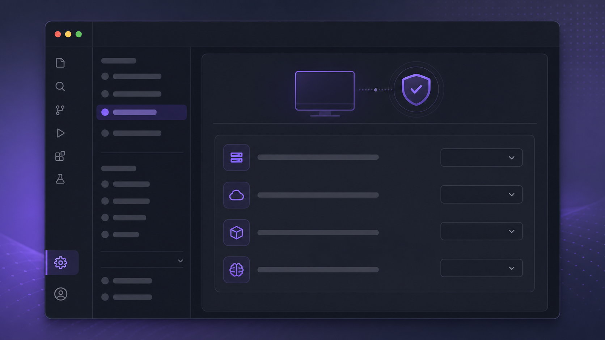

# Save My Model



_Illustrative UI preview; the installed settings section uses BB's native theme._

Save My Model stores provider, model, and reasoning selections in
browser localStorage with host/provider-scoped keys. Its settings section lists
and clears saved values. Reused environments are intentionally not persisted.

This package preserves the storage behavior proposed in [BB PR #1964](https://github.com/get-bb/bb/pull/1964).
Because BB does not currently expose the built-in new-thread picker as a
replaceable plugin slot, the plugin does not silently override that picker; it
provides the durable preference contract for the upstream native integration.

Install from this monorepo:

```sh
bb plugin install git:https://github.com/MateoCerquetella/bb-plugins.git@^0.1.1 --subdirectory plugins/save-my-model --tag-prefix save-my-model/
```

Or install the community listing after it is merged:

```sh
bb plugin install save-my-model
```
